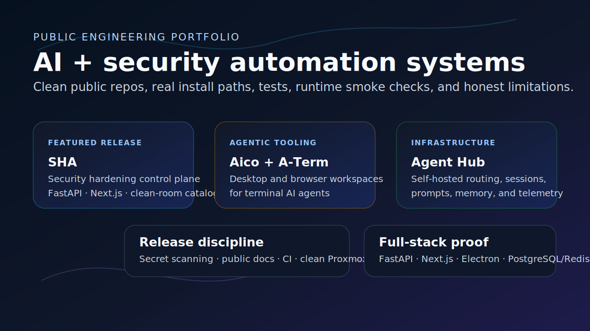
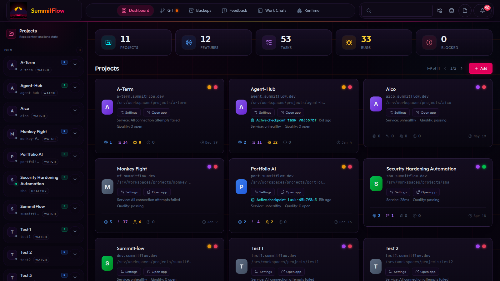
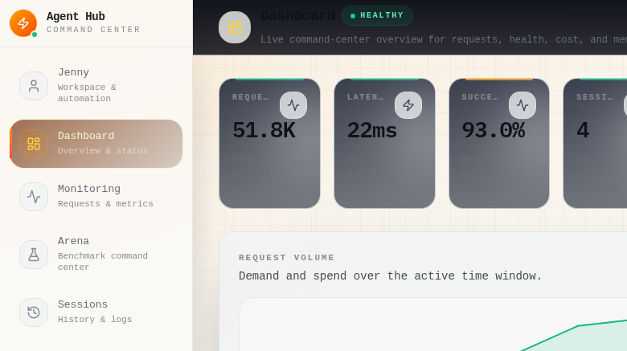
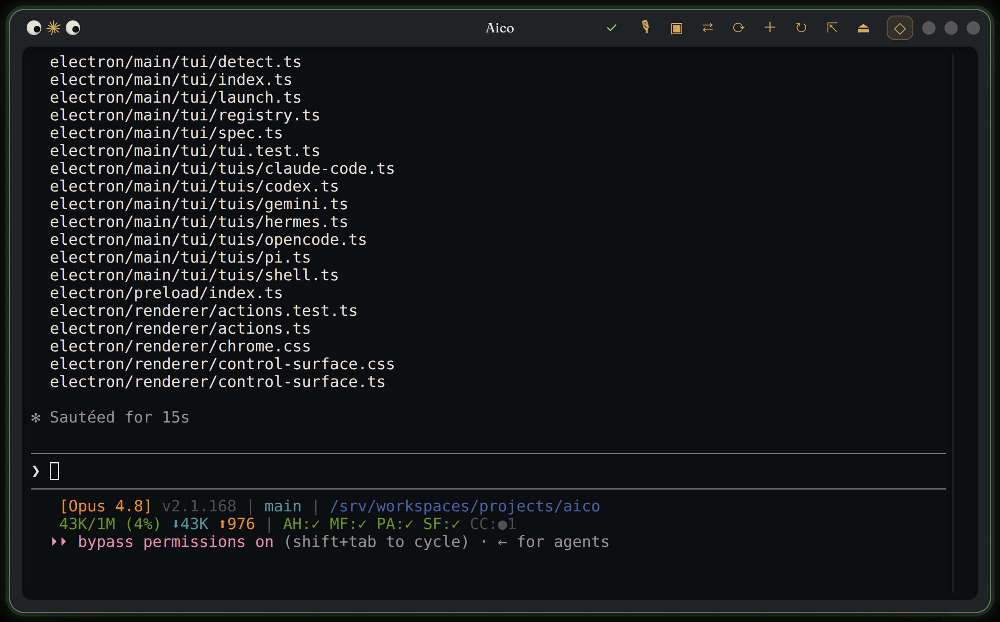
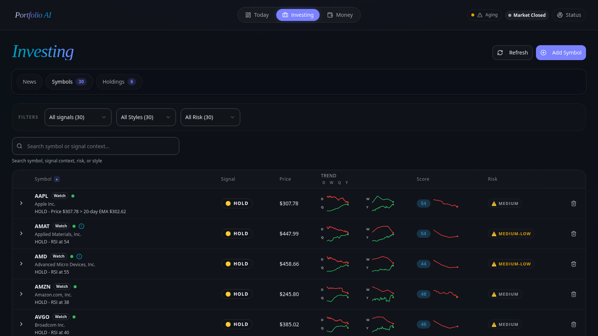

# Elias Leslie — AI, Security Automation, and Infrastructure Tooling

I build practical automation systems at the intersection of **AI automation, security automation, cyber security, agentic developer tooling, and full-stack infrastructure**. My work emphasizes local-first control planes, secure defaults, reproducible release paths, and operator-focused interfaces that turn complex workflows into auditable tools.

I use agentic AI heavily, but I keep the engineering bar concrete: documented setup, real tests, runtime smoke checks, secret hygiene, clean install verification, and honest limitations.

## Projects

Public repositories spanning AI automation, security automation, agentic developer tooling, and full-stack infrastructure — listed by theme, not ranked. Each is a standalone public release with documented setup, real checks, and honest limitations.

### SummitFlow — task orchestration and evidence capture for AI-assisted development

[Repository](https://github.com/elias-leslie/summitflow) · [README](https://github.com/elias-leslie/summitflow/blob/main/README.md) · [Security policy](https://github.com/elias-leslie/summitflow/blob/main/SECURITY.md)

- **Problem:** AI-assisted development scatters task state, quality gates, and verification evidence across one-off scripts and chat logs, so it is hard to see what was actually built, checked, and proven across projects.
- **Solution:** A local-first control plane that tracks tasks, subtasks, steps, and dependencies; runs quality gates and code-health scans; drives autonomous execution hooks and browser checks; and keeps operator-visible verification evidence. Built for developers running their own agent tooling, not as a hosted SaaS.
- **Stack:** FastAPI, Python 3.13, SQLAlchemy, Alembic, Next.js 16, React, TypeScript, PostgreSQL, Redis, Hatchet, pnpm, uv.
- **What was built:** A FastAPI backend (~33 routers) and Next.js operator UI; the `st` CLI (~36 command groups, ~290 subcommands) spanning tasks, quality gates (ruff/types/pytest/biome/tsc/CodeQL), version control (jj-first), services, databases, browser/UI automation, agents, and backups; ~36 Hatchet workflows including an autonomous ideation→execution→review pipeline and self-healing; proof-it-ran evidence capture (UI screenshots, route/health status, console-error counts); Btrfs snapshots and SMB/Veeam-targeted backups; and an Apache-2.0 public release with CI, a Docker Compose source stack, and a security policy.
- **Skills demonstrated:** Full-stack system design, workflow orchestration, CLI and developer-tooling design, runtime smoke verification, and public release discipline (secret/history scanning, dependency remediation, clean install verification).
- **Security/automation/AI relevance:** Keeps agent work local-first and auditable, and degrades clearly when optional integrations (Agent Hub, Hatchet, browser runtime, web push, SMB backups) are absent instead of exposing credentials or crashing unrelated pages.
- **Status:** Public Apache-2.0 release for developers running their own agent tooling. Pairs with Agent Hub for routed AI completions and shared memory, but runs standalone.

### Agent Hub — self-hosted control plane for multi-provider AI agents

[Repository](https://github.com/elias-leslie/agent-hub) · [README](https://github.com/elias-leslie/agent-hub/blob/main/README.md) · [Security policy](https://github.com/elias-leslie/agent-hub/blob/main/SECURITY.md)

- **Problem:** Most agent demos stop at chat. Running agents as real infrastructure needs provider routing, persistent memory, sessions, access control, and cost/latency visibility in one governed place.
- **Solution:** A self-hosted control plane that adds the operational layer: unified completions and streaming across many providers, multi-agent orchestration and server-side tool execution, a pgvector memory-first store with context injection, named agents/personas, session history, request/cost telemetry, access control, and operator dashboards.
- **Stack:** FastAPI, Python 3.13, Next.js 16, React, TypeScript, PostgreSQL with pgvector, Redis, Hatchet, pnpm, uv, plus a sync + async Python SDK.
- **What was built:** Provider routing across Gemini, OpenAI, OpenRouter, DeepSeek, Kimi/Moonshot, MiniMax, xAI, Zhipu (GLM), NVIDIA, Cloudflare Workers AI, OpenAI Codex, and local OpenAI-compatible endpoints, plus image generation across four vendors; a pgvector memory-first store with tiered context injection; multi-agent orchestration (committee, maker-checker, chain, parallel) and an agentic server-side tool loop; a 6-axis model-benchmark catalog, request/cost telemetry, client registration and access control with budgets/quotas, encrypted credentials and OAuth, and a self-improving persona heartbeat; a sync + async Python SDK; and an Apache-2.0 release with public-safe screenshots, CI, and a security policy.
- **Skills demonstrated:** Multi-provider routing, credential boundaries, memory/session infrastructure, SDK design, operability and observability, and public release discipline.
- **Security/automation/AI relevance:** Isolates provider credentials behind access-control surfaces, boots without provider keys (dashboards, health, and sessions stay available), and fails clearly when optional integrations are unconfigured.
- **Status:** Public Apache-2.0 release. Works standalone and as SummitFlow's routed-agent backend. Expose beyond loopback only behind a reverse proxy with strong client/internal secrets.

### Security Hardening Automation (SHA) — bounded control plane for endpoint hardening

[Repository](https://github.com/elias-leslie/sha) · [README](https://github.com/elias-leslie/sha/blob/main/README.md) · [Security policy](https://github.com/elias-leslie/sha/blob/main/SECURITY.md)

- **Problem:** Endpoint hardening often becomes a brittle mix of one-off scripts, undocumented baseline assumptions, risky remote access, and unclear rollback paths.
- **Solution:** SHA models hardening as a bounded control plane: enroll endpoints, collect posture, browse curated controls, generate installer profiles, and route disruptive work through approval requests/grants.
- **Stack:** FastAPI, Python 3.13, SQLAlchemy, Pydantic, Next.js 16, React 19, TypeScript, Vitest, pnpm, uv, SQLite for local development.
- **What was built:** Backend APIs and dashboard pages for fleet/endpoints/controls/installers/approvals; deterministic Linux/Windows bootstrap reporters that run real read-only posture checks (firewall, SSH, root lock, auto-updates / Defender, BitLocker, Secure Boot) and report through a full enroll→heartbeat→posture cycle; a typed, human-in-the-loop approval workflow with bounded grant TTLs and append-only audit; 3 curated control packs (9 controls) from public NIST/DISA/CISA-NSA guidance with 18 generated JSON Schemas; and an Apache-2.0 release with CI and a clean public control-pack path.
- **Skills demonstrated:** Security automation design, public-source provenance cleanup, secret/history scanning, dependency vulnerability remediation, full-stack testing, browser/runtime smoke checks, and clean Proxmox install verification.
- **Security/automation/AI relevance:** Keeps endpoint work bounded to typed hardening workflows, avoids arbitrary shell access, documents approval boundaries, and provides a foundation for supervised operator automation.
- **Status:** Early public control-plane/dashboard slice. It is not production-ready until authentication, authorization, production migrations/deployment hardening, and a completed privileged endpoint agent are added.

### Aico — desktop companion for terminal AI agents

[Repository](https://github.com/elias-leslie/aico)

- **Problem:** Terminal AI agents are useful but fragmented across shells, browser context, desktop selection, and project state.
- **Solution:** A Linux desktop companion that wraps seven terminal AI CLIs (Claude Code, Codex, opencode, Gemini CLI, Pi, Hermes, shells) in persistent tmux-backed "lantern" widgets, with a command palette, per-agent context-mandate verification, a loopback FastAPI sidecar, click-to-context capture, and optional browser/voice integrations.
- **Stack:** Electron, TypeScript, Vite, xterm.js, node-pty, FastAPI, Python 3.13, tmux, uv, Node.js, MV3 browser extension APIs.
- **What was built:** Frameless terminal widgets backed by persistent per-widget tmux sessions; a searchable command palette and pinned controls; per-agent context-mandate verification (✓/⚠ badges); a loopback FastAPI sidecar and MV3 browser extension for click-to-context capture; optional desktop window/region/OCR grab and voice dictation; and an AppImage build with a bundled PyInstaller sidecar, CI, and release hardening (SHA256SUMS + build provenance).
- **Skills demonstrated:** Desktop/Electron integration, local sidecar API design, tmux/session orchestration, browser-context capture, and release hardening.
- **Security/automation/AI relevance:** Keeps sensitive workflow state local by default, uses loopback APIs, and degrades when optional integrations are absent.
- **Status:** Public source release for single-user Linux desktops; Wayland/global shortcut support varies by desktop environment.

### A-Term — browser workspace for AI coding agents

[Repository](https://github.com/elias-leslie/a-term)

- **Problem:** Agentic coding needs shells, files, prompts, and notes in one browser-accessible environment, and naive web terminals lose their session the moment the tab closes.
- **Solution:** A self-hosted browser workspace that runs multiple persistent, tmux-backed terminal sessions (Claude Code, Codex, Gemini CLI, Hermes, OpenCode, Pi, and shells) side by side in a resizable pane grid, with a file browser, a notes/prompt library, voice input, and full mobile support.
- **Stack:** FastAPI, Python 3.13, SQLAlchemy, Alembic, PostgreSQL, Next.js 16, React 19, TypeScript, xterm.js (WebGL), tmux, Tailwind CSS 4, pnpm, uv.
- **What was built:** WebSocket PTY terminals over tmux for crash-proof sessions; up to six resizable panes with detach-to-window; per-pane dual shell/agent mode with built-in tool presets and custom tools; a sandboxed file browser with validated uploads; a notes/prompt library with version history and Agent-Hub-backed prompt cleaning; browser-native voice input; an on-screen keyboard and PWA install for mobile; and three auth modes (loopback/password/proxy) with security headers, CSP, and rate limiting.
- **Skills demonstrated:** Real-time WebSocket/PTY streaming with backpressure, terminal/session orchestration, full-stack developer-experience tooling, mobile/PWA support, and secure-by-default remote access.
- **Security/automation/AI relevance:** Ships loopback-only by default, isolates the file browser against path traversal, and centralizes agent working context locally instead of in a hosted service.
- **Status:** Public project. Runs standalone, or pairs with SummitFlow and Agent Hub for shared projects, prompt cleaning, and a model catalog.

### Portfolio AI — investment intelligence workspace

[Repository](https://github.com/elias-leslie/portfolio-ai)

- **Problem:** Financial research workflows need repeatable ingestion, analysis, and reporting without exposing private holdings.
- **Solution:** A self-hosted, full-stack investment intelligence workspace that tracks portfolios and tax lots, scores a watchlist from market data, news, technicals, and fundamentals, computes a macro deployment gate, and optionally routes AI analysis through an Agent Hub companion — all on data you host.
- **Stack:** FastAPI, Python 3.13, SQLAlchemy, Next.js 16, React 19, PostgreSQL, Redis, Hatchet, pandas, scikit-learn, pandas-ta; yfinance, CBOE, FRED, and SEC EDGAR data plus optional paid market-data APIs.
- **What was built:** Portfolio/tax-lot/transaction tracking with cost basis, P&L, tax-loss harvesting (wash-sale checks), and IPS drift/rebalance; a multi-pillar watchlist scorer with plain-language narratives; a macro deployment gate (FULL_DEPLOY/REDUCED/DEFENSIVE) with walk-forward and Monte Carlo backtests; ~63 cron-scheduled Hatchet workflows; household money, document-intake, budgeting, and retirement (Monte Carlo) surfaces with encrypted Plaid/SnapTrade linking; an AI investment-committee and thesis pipeline routed entirely through Agent Hub (no hardcoded model IDs); and a read-only MCP server.
- **Skills demonstrated:** Multi-source data pipelines, quantitative/technical analysis, lightweight ML, workflow orchestration at scale, full-stack reporting UI, and privacy-aware public documentation.
- **Security/automation/AI relevance:** Boots without optional keys (degrading rather than failing), encrypts source and broker credentials at rest, keeps all LLM access behind Agent Hub, and uses only public claims with no real balances, holdings, transactions, account IDs, brokerage names tied to real data, or live portfolio values.
- **Status:** Public project; users must configure their own data sources and secrets.

### Portfolio — public proof hub

[Repository](https://github.com/elias-leslie/portfolio)

- **Problem:** Public work needs a credible, hiring-focused hub that is polished without exposing proprietary/customer/private claims.
- **Solution:** A Markdown-first GitHub portfolio with project case studies, safe visual proof, PDF sources/exports, and links to public repos.
- **Stack:** GitHub README/Pages-style Markdown, maintainable PDF source, release screenshots/demo visuals.
- **What was built:** Project case studies, maintainable PDF sources with a render script, safe visual assets, and public-claim hygiene.
- **Skills demonstrated:** Technical writing, public-claim hygiene, documentation tooling, and release-proof curation.
- **Security/automation/AI relevance:** Curates public-safe visual proof and avoids proprietary, customer, or private claims.
- **Status:** Public portfolio repository; updated as projects are released.

## Capability areas

- **AI automation and agentic tooling:** local-first agent workflows, prompt/session infrastructure, terminal/browser context capture, multi-provider control planes.
- **Security automation:** endpoint hardening, incident containment concepts, detection workflows, evidence exports, rollout/rollback discipline.
- **Cyber security engineering:** secure defaults, secret scanning, local API boundaries, install-time dependency verification, public release hygiene.
- **Developer tooling:** tmux/session orchestration, desktop/browser integrations, clean installers, CI, test suites, smoke tests.
- **Full-stack infrastructure:** FastAPI, Next.js/Electron, PostgreSQL/Redis-style backends, operator dashboards, Linux service/runtime integration.

## Downloads

- [Detailed portfolio PDF](./docs/Detailed_Portfolio.pdf)
- [Security automation summary PDF](./docs/Elias_Leslie_Portfolio_Summary_Security_Automation.pdf)
- [Detailed PDF Markdown source](./docs/Detailed_Portfolio.md)
- [Summary PDF Markdown source](./docs/Elias_Leslie_Portfolio_Summary_Security_Automation.md)

## Contact

- LinkedIn: <https://linkedin.com/in/elias-leslie>
- GitHub: <https://github.com/elias-leslie>

_Last updated: 2026-06-09_
