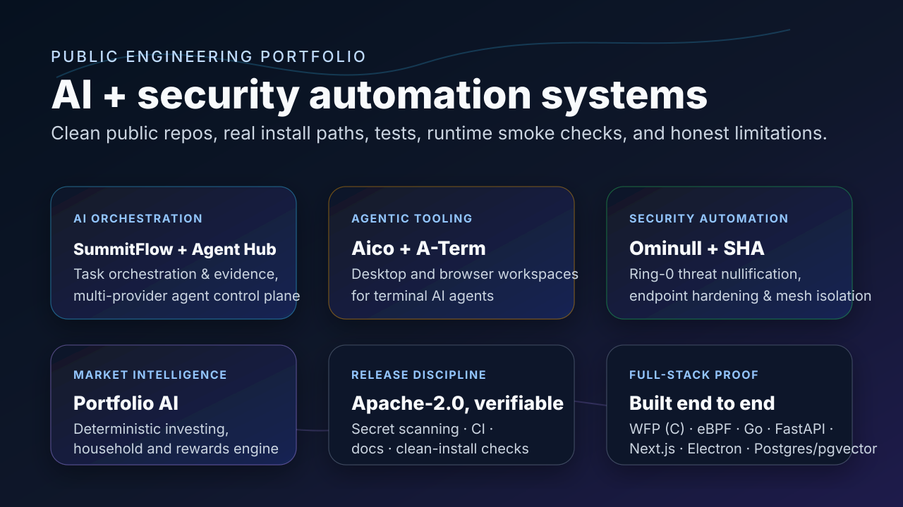
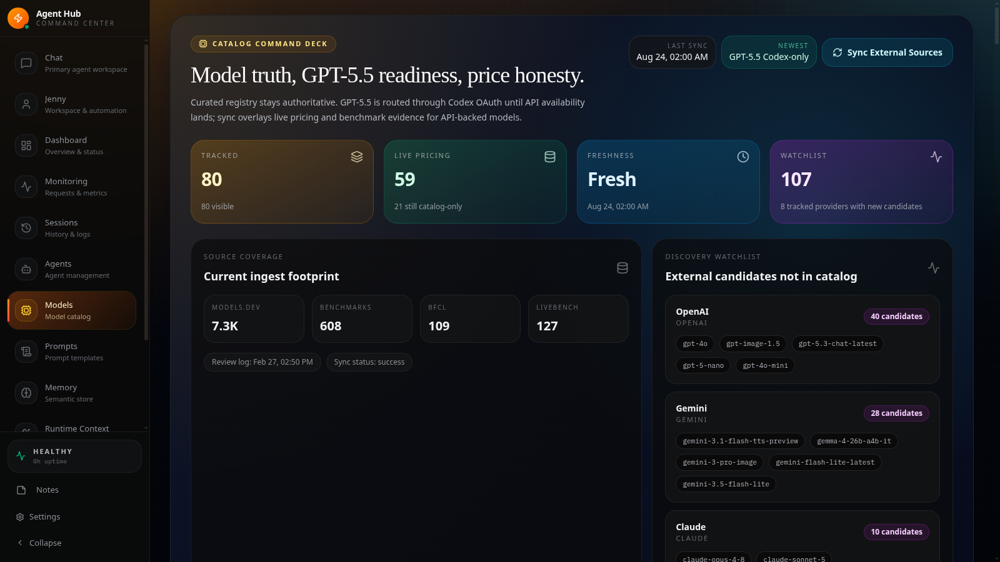
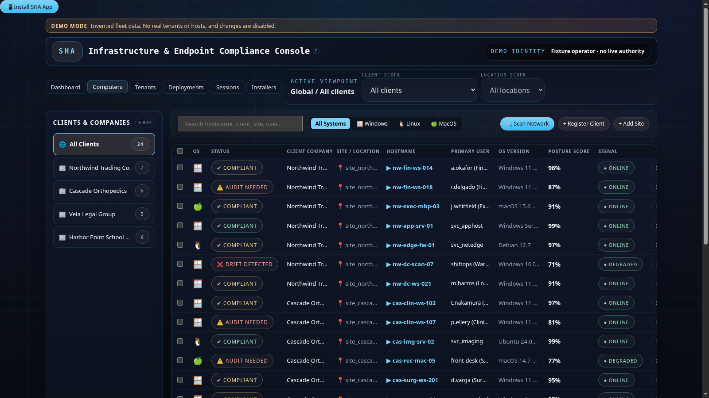
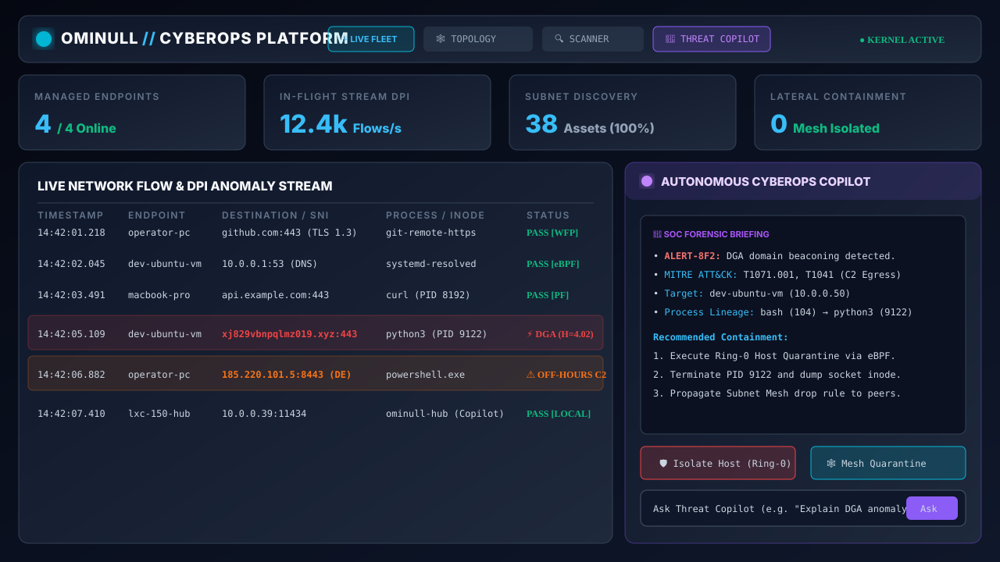
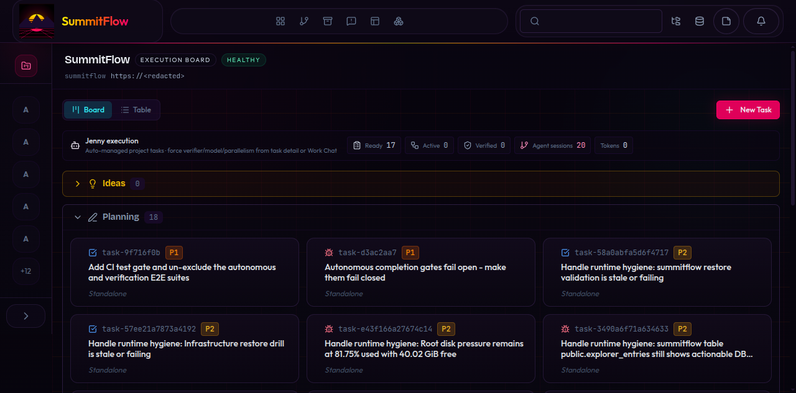
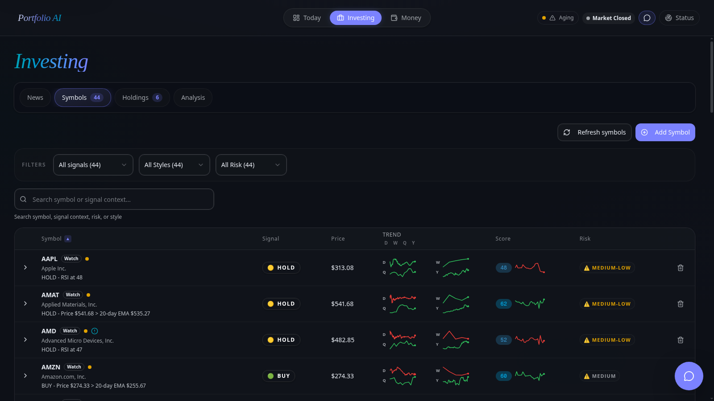
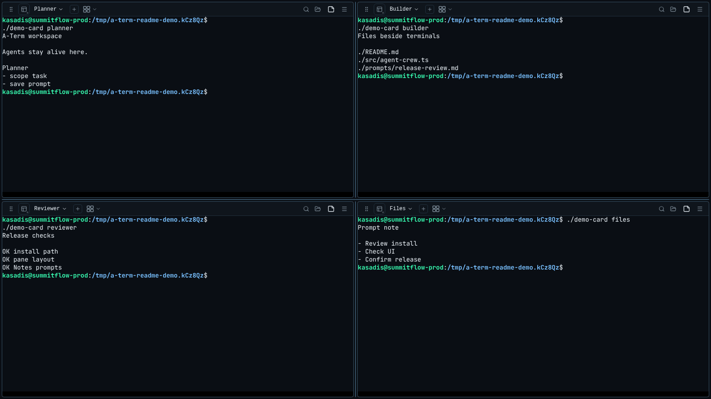
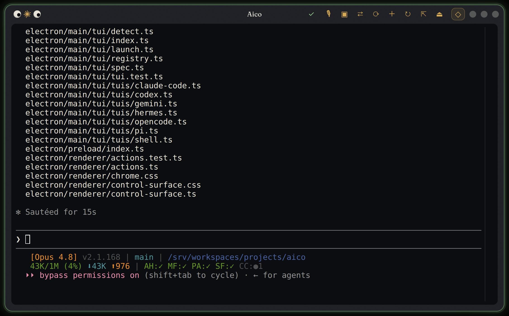

# Elias Leslie — AI, Security Automation, and Infrastructure Tooling

I build practical automation systems at the intersection of **AI automation, security automation, cyber security, agentic developer tooling, and full-stack infrastructure**. My work emphasizes local-first control planes, secure defaults, reproducible release paths, and operator-focused interfaces that turn complex workflows into auditable tools.

I use agentic AI heavily, but I keep the engineering bar concrete: documented setup, real tests, runtime smoke checks, secret hygiene, clean install verification, and honest limitations.

## Background

25+ years in IT and security, spanning hands-on engineering and executive leadership. I grew from Director of IT to Chief Information Security Officer at a managed services provider serving 200+ client environments, building the security program and automation framework that became a primary strategic asset in the company's 2024 acquisition by Integris — then spent the following year as Security Services Architect refactoring that tooling into platform-agnostic frameworks and mentoring engineers on AI-augmented development.

Alongside that, I served as incident commander on ransomware and breach engagements referred through Lloyd's of London cyber insurance underwriters — seven-figure-ransom recoveries across 26 states and multiple countries, directing client engineering organizations, outsourced IT providers, and third-party vendors. OSCP certified.

The projects below are what that experience looks like when I build in the open.

## Projects

Seven public platforms released under Apache-2.0, each a standalone repository with documented setup, real checks, CI, a security policy, and honest limitations.

### Agent Hub — self-hosted control plane for multi-provider AI agents

[Repository](https://github.com/elias-leslie/agent-hub) · [Security policy](https://github.com/elias-leslie/agent-hub/blob/main/SECURITY.md)

- **Problem:** Most agent demos stop at chat. Running agents as real infrastructure needs provider routing, persistent memory, sessions, access control, and cost/latency visibility in one governed place.
- **Solution:** A self-hosted control plane that adds the operational layer: unified completions and SSE streaming across many providers, multi-agent orchestration and server-side tool execution, a pgvector memory-first store with tiered context injection, named agents/personas, session history, request/cost telemetry, access control, and operator dashboards.
- **Stack:** FastAPI, Python 3.13, Next.js 16, React, TypeScript, PostgreSQL with pgvector, Redis, Hatchet, pnpm, uv, plus a sync + async Python SDK.
- **Routing and providers:** Unified completions and streaming across 12 providers — Gemini, OpenAI, OpenRouter, DeepSeek, Kimi/Moonshot, MiniMax, xAI, Zhipu (GLM), NVIDIA, Cloudflare Workers AI, OpenAI Codex, and any local OpenAI-compatible endpoint — with catalog-driven model resolution, per-agent routing with fallbacks, a provider circuit breaker, runtime health probing, and image generation across four vendor adapters. Model selection is backed by a 6-axis catalog (coding, reasoning, planning, tool use, instruction following, design) carrying per-token, per-image, and per-second pricing.
- **Agents, memory, and orchestration:** A pgvector memory-first store with semantic search, episodes, learning extraction, tiering/promotion/retirement, and citation-tracked context injection; stateful sessions with branching, ingestion, LLM summaries, and token accounting; named agents/personas with version history, a benchmark dashboard, and a self-improving persona heartbeat; a DB-backed prompts catalog with revisions and per-agent assignment; and multi-agent orchestration — a staged clarify → plan → execute → review → QA workflow plus maker-checker, chain, parallel fan-out, sub-agents, code review, and a committee/roundtable — over an agentic server-side tool loop (shell, file read/write/edit, precision code search, and web search/research/fetch backed by SearXNG and a CDP browser).
- **Operability:** Keyless boot; encrypted credential isolation (Fernet at rest) with OAuth/PKCE, client registration, per-project permissions, budgets/quotas, and per-tenant cost attribution; request logs, truncation events, and cost/latency analytics behind operator dashboards; optional web push (VAPID), Telegram, and voice (faster-whisper STT → completion → edge-tts) integrations; a sync + async Python SDK; ~39 API routers across 191 endpoints and 15 Hatchet workflows.
- **Notable engineering decision:** The memory layer originally ran on a Neo4j/Graphiti knowledge graph. I migrated it to a unified pgvector store — semantic search, episodes, learning extraction, tiering/promotion/retirement, and citation-tracked context injection — collapsing an entire second datastore out of the deployment while keeping the retrieval semantics.
- **Design stance:** The individual capabilities exist elsewhere in pieces — Langfuse does tracing, LiteLLM proxies providers, OpenRouter hosts routing. Agent Hub's bet is that routing, memory, sessions, personas, and telemetry belong *integrated and memory-first in one self-hosted control plane* rather than stitched together across four services. Anthropic/Claude is catalogued for reference but deliberately excluded from workload routing.
- **Skills demonstrated:** Multi-provider routing, credential boundaries, memory/session infrastructure, schema migration under live semantics, SDK design, operability and observability.
- **Security relevance:** Isolates provider credentials behind access-control surfaces, boots without provider keys (dashboards, health, and sessions stay available), and fails clearly when optional integrations are unconfigured.
- **Status:** Public Apache-2.0 release. Works standalone and as SummitFlow's routed-agent backend. Expose beyond loopback only behind a reverse proxy with strong client/internal secrets.

### Security Hardening Automation (SHA) — bounded control plane for endpoint hardening

[Repository](https://github.com/elias-leslie/sha) · [Security policy](https://github.com/elias-leslie/sha/blob/main/SECURITY.md)

- **Problem:** Endpoint hardening often becomes a brittle mix of one-off scripts, undocumented baseline assumptions, risky remote access, and unclear rollback paths.
- **Solution:** SHA models hardening as a *bounded* control plane: enroll endpoints, collect posture, browse curated controls, generate installer profiles, and route every disruptive action through a typed human approval gate.
- **Stack:** FastAPI, Python 3.13, SQLAlchemy, Pydantic, a cross-compiled Go endpoint agent, Next.js 16, React 19, TypeScript, Vitest, pnpm, uv.
- **What was built:** A control-plane API (15 routers, 49 endpoints) and operator dashboard covering a unified client/site hierarchy, endpoint inventory with device classification, a network discovery scan, controls, installers, and approvals; deterministic Windows/Linux/macOS posture reporters running real read-only checks (host firewall, SSH configuration, root access lock, automatic updates, Microsoft Defender, BitLocker, Secure Boot, FileVault, Gatekeeper) through a full enroll → heartbeat → posture → action-claim → lease-bound-result cycle; 4 curated control packs (17 controls) built by a deterministic, provenance-pinned catalog builder from public NIST SP 800-53 Rev. 5, DISA Windows Server 2022 STIG, and CISA/NSA guidance, every control carrying NIST CSF / SP 800-53 / STIG / CISA mappings; a typed human-in-the-loop approval workflow with bounded grant TTLs (15–240 minutes), manual emergency grants, and append-only tamper-evident audit events; lease-bound action delivery with principal-separated access (operator / read-only / agent) behind fail-closed OIDC with CSRF and origin enforcement; and reversible typed hardening actions with rollback artifacts, weighted per-endpoint posture scores, and a control drift matrix.
- **Demonstrable without a fleet:** The console ships a self-contained demo mode that answers every read from an invented tenant set and refuses every mutation, so it can be screen-shared or published without exposing a real deployment — the screenshot above is that mode.
- **Design stance:** No shell or arbitrary-command endpoint exists anywhere in the API. SHA sits deliberately between pure auditors (Lynis, OpenSCAP) and unbounded appliers (ansible-lockdown, Wazuh active response) — every disruptive action is a typed capability behind a mandatory approval gate.
- **Skills demonstrated:** Security automation design, public-source provenance discipline, approval-boundary modeling, cross-platform agent development, full-stack testing, and clean install verification.
- **Status:** Early-stage working control-plane slice, not a production-ready endpoint-management product. Public Apache-2.0 release.

### Ominull — autonomous cyberops and ring-0 threat nullification platform

[Repository](https://github.com/elias-leslie/ominull) · [Security policy](https://github.com/elias-leslie/ominull/blob/main/SECURITY.md)

- **Problem:** Endpoint threat response often relies on heavy, laggy user-mode agents or opaque third-party cloud EDRs that cannot isolate threats at microsecond kernel speeds without severing administrative forensic reachability.
- **Solution:** An ultra-lean, cross-platform kernel network security and autonomous Incident Response (IR) platform providing microsecond ring-0 enforcement, in-flight Deep Packet Inspection (TLS ClientHello SNI and DNS wire dissection), statistical behavioral anomaly profiling, subnet quarantine mesh isolation, automated 1-click remote push-deployment, and an embedded 24/7 AI CyberOps Copilot.
- **Stack:** Go 1.24, C (C11), Windows Filtering Platform (WFP) kernel driver (`ominull.sys`), Linux eBPF / TC packet classifiers, macOS `pfctl` anchors, SQLite, WebSockets, Local Ollama (`llama3.2`), Gemini API.
- **Dual-tier threat containment:** Microsecond ring-0 host isolation dropping 100% of ingress and egress traffic at the kernel driver layer with an encrypted, unidirectional forensic pinhole back to the Hub; plus a Subnet Quarantine Mesh (`MESH_ISOLATE_PEER`) that commands all managed endpoints on an L2 broadcast domain to drop traffic to/from rogue, unmanaged, or compromised IoT devices.
- **Discovery, fingerprinting, and stream DPI:** Multi-tier subnet asset discovery (ARP + TCP SYN probes + reverse PTR) with extensible multi-vector OS fingerprinting (TTL, TCP window size, app-layer response latency delta $\Delta t$, banner inspection, and dynamic operator/AI training feedback); in-flight TLS 1.3 `ClientHello` SNI parser and DNS wire dissector; and a Shannon entropy heuristic ($>3.85$ bits/byte) to detect Domain Generation Algorithms (`SUSPICIOUS_DGA_DOMAIN`).
- **Behavioral anomaly engine:** Diurnal time-of-day hourly baselines flagging off-hours workstation activity (e.g. interactive shell egress at 02:00 UTC), real-time Welford's algorithm exfiltration spike Z-scores ($Z > 3.5$), periodic C2 beaconing jitter detection ($\Delta t < 0.2\text{s}$), and internal lateral port sweep / fan-out detection.
- **Autonomous AI Copilot & 1-click deployer:** Embedded multi-model AI copilot (Local Ollama, Google Gemini Free Tier, OpenAI) with conversational ChatOps and automated MITRE ATT&CK forensic briefings; pure-Go SSH push-deployment engine for 1-click agent rollouts across discovered assets; and an operator console built as a zero-CDN, zero-NPM, embedded single-binary dashboard.
- **Design stance — kernel speed with forensic pinholing:** Threat isolation must happen in microseconds inside ring-0, but cutting a host off from the network shouldn't blind the security operations center. Ominull enforces strict default-deny isolation in the kernel driver while maintaining a live, secure telemetry and remediation pinhole to the Hub.
- **Skills demonstrated:** Kernel driver development (WFP ALE callouts and sublayers), eBPF / TC network filtering, low-level packet dissection (TLS/DNS), statistical anomaly detection, multi-model AI agent integration, pure-Go SSH provisioning, and zero-dependency web engineering.
- **Security relevance:** Eliminates external cloud dependencies for threat nullification, isolates malicious traffic at the kernel before socket layer delivery, protects unmanaged network peers via mesh containment, and operates with zero secrets stored on disk.
- **Status:** Public Apache-2.0 release. Fully functional standalone or deployed in multi-tenant MSP/enterprise environments.

### SummitFlow — task orchestration and evidence capture for AI-assisted development

[Repository](https://github.com/elias-leslie/summitflow) · [Security policy](https://github.com/elias-leslie/summitflow/blob/main/SECURITY.md)

- **Problem:** AI-assisted development scatters task state, quality gates, and verification evidence across one-off scripts and chat logs, so it is hard to see what was actually built, checked, and proven across projects.
- **Solution:** A local-first control plane that tracks tasks, subtasks, steps, and dependencies; runs quality gates and code-health scans; drives autonomous execution hooks and browser checks; and keeps operator-visible verification evidence. Built for developers running their own agent tooling, not as a hosted SaaS.
- **Stack:** FastAPI, Python 3.13, SQLAlchemy, Alembic, Next.js 16, React, TypeScript, PostgreSQL, Redis, Hatchet, pnpm, uv.
- **What was built:** A FastAPI backend (~30 routers across ~297 routes) and a Next.js operator UI, driven by the `st` CLI — 75 top-level commands and ~262 subcommands spanning task lifecycle (claim leasing, dependencies, JSONB-stored verification/review evidence, cross-agent coordination and a preflight gate), quality gates (ruff, types, pytest, biome, tsc, vitest, sqlfluff, squawk, CodeQL alert state, and an isolated cleanroom run), version control (jj-first, including rollback of already-pushed work), services and runtime, databases and migrations, browser/UI automation, agents, file-level leases, and backups.
- **Automation and self-healing:** ~33 Hatchet workflows including an autonomous ideation → execution → review pipeline; an LLM auto-fix agent with pattern memory; `radon` complexity assessment, code-graph topology and JS/TS dead-code audits, and precision symbol/endpoint/table search; Btrfs snapshots with SMB/Veeam-targeted backups; and `summitflow-host-guardian` independent host monitoring.
- **Design stance — proof it ran:** The differentiator is evidence, not tracking. Autonomous runs capture headless page screenshots, route/health telemetry, and console-error counts, analyze the screenshots with a vision model, and attach the result to the task — so "done" means an artifact a reviewer can open, not a status field someone set.
- **Skills demonstrated:** Full-stack system design, workflow orchestration, CLI and developer-tooling design, runtime smoke verification, and public release discipline (secret/history scanning, dependency remediation, clean install verification).
- **Security relevance:** Keeps agent work local-first and auditable, and degrades clearly when optional integrations (Agent Hub, Hatchet, browser runtime, web push, SMB backups) are absent instead of exposing credentials or crashing unrelated pages.
- **Status:** Public Apache-2.0 release. Pairs with Agent Hub for routed AI completions and shared memory, but runs standalone.

### Portfolio AI — self-hosted investment, household, and rewards intelligence workspace

[Repository](https://github.com/elias-leslie/portfolio-ai) · [Security policy](https://github.com/elias-leslie/portfolio-ai/blob/main/SECURITY.md)

- **Problem:** Self-hosted personal-finance tools split into three camps that do not talk to each other — portfolio trackers, household budgeters, and research terminals — and the ones that bolt on AI let a language model invent the numbers it then reasons about.
- **Solution:** One self-hosted workspace that spans all three, built on a deterministic analytical core: portfolio and tax-lot tracking, a scored research watchlist with plain-language narratives, a macro deployment gate, household budgeting and retirement planning, and a full credit-card rewards engine — all on data you host, with AI confined to the edges where judgment over unstructured input is the actual problem.
- **Stack:** FastAPI, Python 3.13, SQLAlchemy 2, Alembic, Pydantic 2, Next.js 16, React 19, Tailwind CSS 4, PostgreSQL 16, Redis, Hatchet, pandas, scikit-learn, pandas-ta; yfinance, CBOE, and SEC EDGAR with no key required, plus optional FRED, TwelveData, FMP, Polygon, Finnhub, and AlphaVantage.
- **Investing core:** Portfolio, account, position, tax-lot, transaction, and snapshot tracking with lot-level cost basis and P&L, tax-loss harvesting with wash-sale checks, and IPS target/drift/rebalance planning; a multi-pillar watchlist scorer (price, technical, fundamental, catalyst, options) producing per-symbol composites with plain-language narratives over an S&P 500 research universe that discovers and trims its own candidates; a macro deployment gate (FULL_DEPLOY / REDUCED / DEFENSIVE) computed from VIX term structure, credit spreads, put/call, breadth, and factor crowding, with walk-forward and Monte Carlo backtests; technical analysis (RSI, MACD, Bollinger Bands, ATR, VWAP) and a lightweight ML layer — a scikit-learn article-quality classifier and TF-IDF news clustering — over ingested OHLCV, intraday, fundamentals, macro, and RSS news; a forward catalyst calendar; and ~63 cron-scheduled Hatchet workflows covering ingestion, scoring, catalysts, strategy research, data-freshness monitoring, and maintenance.
- **Household money and rewards:** Budgeting, document intake, and Monte Carlo retirement scenarios with encrypted Plaid and SnapTrade account linking; plus a complete household credit-card surface — catalog-driven rewards ranking with configurable valuation and credit stances, a two-player 90-day application/rotation planner that models real issuer rules (Chase 5/24, Amex lifetime language, Capital One velocity), keeper-card spend routing, welcome-bonus tracking that accounts for soft and provisional charges, AI screenshot intake for targeted offers, monthly catalog research, and Telegram alerts for spend pace, bonus deadlines, rotation actions, and annual-fee renewals.
- **Design stance — deterministic core, agents at the edges:** Every number the app acts on — pillar scores, the macro gate, covariance and volatility, drift, retirement projections, card rotation rules — is computed in Python from stored data, so it is reproducible and back-testable. Agents are used only where unstructured input is the problem: reading a statement or an offer screenshot, validating and invalidating a thesis against the evidence, answering questions about your own holdings. An agent may call deterministic code as a tool; it never decides what a position is worth or whether to buy it, and it never sees a hardcoded model ID — all LLM access routes through Agent Hub.
- **Interfaces:** A Next.js operator UI, a documented FastAPI surface (portfolio, watchlist, symbols, market, macro, thesis, catalysts, retirement, household, cards), and a read-only MCP server (`portfolio-ai-mcp`) exposing three deterministic stdio tools — `get_deployment_zone`, `get_deployment_history`, `get_symbol_full_picture` — so an MCP client can query the signal stack without triggering model inference.
- **Skills demonstrated:** Multi-source data pipelines, quantitative and technical analysis, lightweight ML, rules-engine modeling of external policy, workflow orchestration at scale, MCP server design, full-stack reporting UI, and privacy-aware public documentation.
- **Security relevance:** Boots without optional keys (degrading rather than failing), encrypts source and broker credentials at rest, keeps all LLM access behind Agent Hub, and publishes only synthetic claims — no real balances, holdings, transactions, account IDs, or live portfolio values.
- **Status:** Public Apache-2.0 release; users configure their own data sources and secrets. Not investment advice and it places no trades — it produces analysis, not orders.

### A-Term — browser workspace for AI coding agents

[Repository](https://github.com/elias-leslie/a-term) · [Security policy](https://github.com/elias-leslie/a-term/blob/main/SECURITY.md)

- **Problem:** Agentic coding needs shells, files, prompts, and notes in one browser-accessible environment, and naive web terminals lose their session the moment the tab closes.
- **Solution:** A self-hosted browser workspace that runs multiple persistent, tmux-backed terminal sessions (Claude Code, Codex, Gemini CLI, Hermes, OpenCode, Pi, and shells) side by side in a resizable pane grid, with a file browser, a notes/prompt library, voice input, and full mobile support.
- **Stack:** FastAPI, Python 3.13, SQLAlchemy, Alembic, PostgreSQL, Next.js 16, React 19, TypeScript, xterm.js (WebGL), tmux, Tailwind CSS 4, pnpm, uv.
- **What was built:** WebSocket PTY terminals over tmux for crash-proof sessions that survive both browser and server restarts; up to six resizable panes with detach-to-window; per-pane dual shell/agent mode with built-in tool presets and custom tools; a sandboxed file browser with validated uploads; a notes/prompt library with version history and Agent-Hub-backed prompt cleaning; browser-native voice input; an on-screen keyboard and PWA install for mobile; and three auth modes (loopback/password/proxy) with security headers, CSP, and rate limiting.
- **Design stance:** Browser terminals, modern desktop terminals, and tmux each solve one part of this. A-Term is not trying to replace a terminal emulator — it wraps the *whole* coding loop (several agents side by side, durable sessions, files, and reusable prompts) into one workspace reachable from any device, self-hosted, with no account or cloud service.
- **Skills demonstrated:** Real-time WebSocket/PTY streaming with backpressure, terminal/session orchestration, full-stack developer-experience tooling, mobile/PWA support, and secure-by-default remote access.
- **Security relevance:** Ships loopback-only by default, isolates the file browser against path traversal, and centralizes agent working context locally instead of in a hosted service.
- **Status:** Public Apache-2.0 release. Runs standalone, or pairs with SummitFlow and Agent Hub for shared projects, prompt cleaning, and a model catalog.

### Aico — desktop companion for terminal AI agents

[Repository](https://github.com/elias-leslie/aico) · [Security policy](https://github.com/elias-leslie/aico/blob/main/SECURITY.md)

- **Problem:** Terminal AI agents are useful but fragmented across shells, browser context, desktop selection, and project state — and the thing you want the agent to look at is almost always already on your screen.
- **Solution:** A Linux desktop companion that wraps seven terminal AI CLIs (Claude Code, Codex, opencode, Gemini CLI, Pi, Hermes, shells) in persistent tmux-backed "lantern" widgets, then lets you tag a browser page, a selection, a window, or a screen region straight into the running agent's prompt.
- **Stack:** Electron, TypeScript, Vite, xterm.js, node-pty, FastAPI, Python 3.13, tmux, uv, Node.js, MV3 browser extension APIs.
- **What was built:** Frameless terminal widgets over persistent per-widget tmux sessions with stable generation/session/pane ownership — closing a widget only detaches, so work reattaches across close, reopen, and restart, and historical sessions are preserved read-only rather than reaped for being old; a searchable command palette and pinned, drag-reorderable controls over one action registry; an agent launcher that swaps the TUI in a focused widget; per-agent context-mandate verification (✓/⚠ badges) that checks wiring without silently installing hooks; session lifecycle diagnostics reporting owner, tmux target, scope, age, CPU/memory, and containment warnings without broad process scans; a read-only scrollback overlay; attach-detection for external tmux sessions; a loopback FastAPI sidecar and MV3 browser extension for click-to-context capture; optional desktop window/region/OCR grab and voice dictation; and an AppImage build with a bundled PyInstaller sidecar, CI, and release hardening (SHA256SUMS + build provenance).
- **Design stance:** Deliberate, on-demand tagging — not always-on recording. Screen-history tools capture everything and make you search it later; other launchers route capture into their own chat. Aico's target is *your* terminal agent, on Linux, with the capture happening only when you ask for it.
- **Skills demonstrated:** Desktop/Electron integration, local sidecar API design, tmux/session orchestration, browser-context capture, and release hardening.
- **Security relevance:** Keeps sensitive workflow state local by default, uses loopback APIs, captures only on explicit action, and degrades when optional integrations are absent.
- **Status:** Public Apache-2.0 release for single-user Linux desktops; Wayland/global shortcut support varies by desktop environment.

## Private work

**BlackBox — zero-knowledge encrypted media archive.** A private household archive spanning a Kotlin/Jetpack Compose Android client and a Go vault service, built around nine documented security invariants that a change may not weaken without a recorded decision. Media is sealed with AES-256-GCM under Android Keystore (StrongBox where available) *before* it is written to disk, so plaintext never reaches storage; there is no write path to `MediaStore` or any shared collection, no exported provider or `FileProvider`, `allowBackup=false`, and `FLAG_SECURE` on every window. The vault server never holds a media decryption key.

Every device generates a P-256 key at first run and its identity *is* the SHA-256 of that public key, so listeners present a self-signed certificate whose key is the identity key and pinning an invitation fingerprint authenticates the specific device rather than a name a CA could reissue. Recovery runs through a five-word EFF-long-list passphrase (64.6 bits) stretched with Argon2id (64 MiB, t=3), with the archive publishing only salt, cost parameters, and a public key. Storage is content-addressed and immutable with additive mirroring, copy-census-gated eviction, and tombstoned deletes that still reach an archive drive that was offline at the time.

Source is private, but I am happy to walk through the architecture and threat model on request.

## Capability areas

- **Security leadership:** security program design, fractional CISO governance, board and underwriter communication, incident command, third-party risk, CMMC/DFARS/HIPAA/PCI/CJIS compliance.
- **Security automation:** endpoint hardening, control-catalog provenance, approval boundaries, incident containment, detection workflows, evidence exports, rollout/rollback discipline.
- **AI automation and agentic tooling:** multi-provider control planes, local-first agent workflows, prompt/session/memory infrastructure, terminal and browser context capture, supervised automation boundaries.
- **Cyber security engineering:** secure defaults, applied cryptography and key management, secret scanning, local API boundaries, install-time dependency verification, public release hygiene.
- **Full-stack infrastructure:** FastAPI, Next.js/Electron, PostgreSQL/pgvector/Redis, workflow orchestration, operator dashboards, Linux service and runtime integration.

## Contact

- LinkedIn: <https://linkedin.com/in/elias-leslie>
- GitHub: <https://github.com/elias-leslie>

_Last updated: 2026-08-24_
