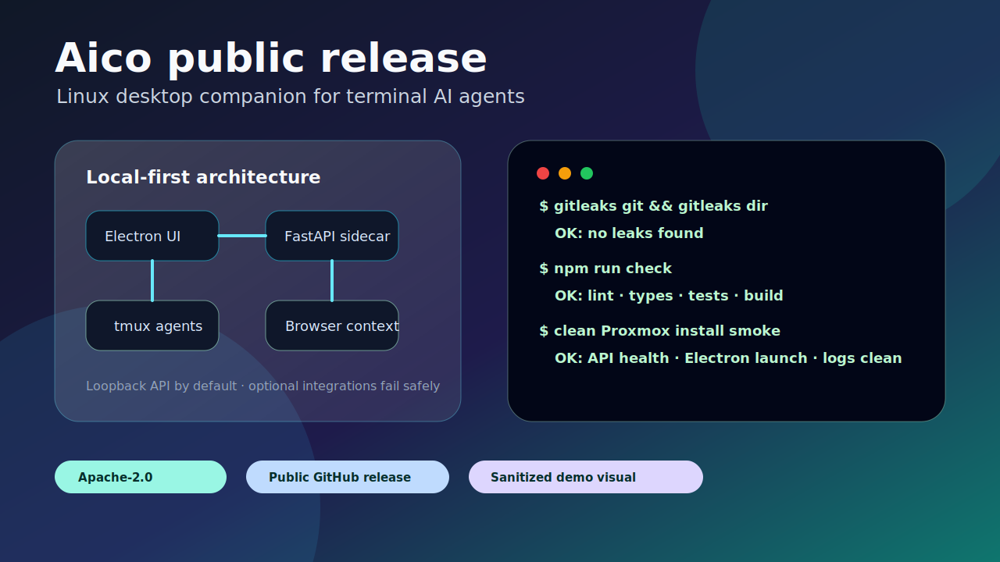

# Elias Leslie — AI, Security Automation, and Infrastructure Tooling

I build practical automation systems at the intersection of **AI automation, security automation, cyber security, agentic developer tooling, and full-stack infrastructure**. My work emphasizes local-first control planes, secure defaults, reproducible release paths, and operator-focused interfaces that turn complex workflows into auditable tools.

I use agentic AI heavily, but I keep the engineering bar concrete: documented setup, real tests, runtime smoke checks, secret hygiene, clean install verification, and honest limitations.

## Projects

Public repositories spanning AI automation, security automation, agentic developer tooling, and full-stack infrastructure — listed by theme, not ranked. Each is a standalone public release with documented setup, real checks, and honest limitations.

### SummitFlow — task orchestration and evidence capture for AI-assisted development

[Repository](https://github.com/elias-leslie/summitflow) · [README](https://github.com/elias-leslie/summitflow/blob/main/README.md) · [Security policy](https://github.com/elias-leslie/summitflow/blob/main/SECURITY.md)

- **Problem:** AI-assisted development scatters task state, quality gates, and verification evidence across one-off scripts and chat logs, so it is hard to see what was actually built, checked, and proven across projects.
- **Solution:** A local-first control plane that tracks tasks, subtasks, steps, and dependencies; runs quality gates and code-health scans; drives autonomous execution hooks and browser checks; and keeps operator-visible verification evidence. Built for developers running their own agent tooling, not as a hosted SaaS.
- **Stack:** FastAPI, Python 3.13, SQLAlchemy, Alembic, Next.js 16, React, TypeScript, PostgreSQL, Redis, Hatchet, pnpm, uv.
- **What was built:** A FastAPI backend and Next.js operator UI for project/task state, Hatchet-driven scheduled and event-driven workflows, the `st` CLI for task/project/check/database/backup/browser/workflow operations, UI/API smoke-test evidence capture, and an Apache-2.0 public release with CI, a Docker Compose source stack, and a security policy.
- **Skills demonstrated:** Full-stack system design, workflow orchestration, CLI and developer-tooling design, runtime smoke verification, and public release discipline (secret/history scanning, dependency remediation, clean install verification).
- **Security/automation/AI relevance:** Keeps agent work local-first and auditable, and degrades clearly when optional integrations (Agent Hub, Hatchet, browser runtime, web push, SMB backups) are absent instead of exposing credentials or crashing unrelated pages.
- **Status:** Public Apache-2.0 release for developers running their own agent tooling. Pairs with Agent Hub for routed AI completions and shared memory, but runs standalone.

### Agent Hub — self-hosted control plane for multi-provider AI agents

[Repository](https://github.com/elias-leslie/agent-hub) · [README](https://github.com/elias-leslie/agent-hub/blob/main/README.md) · [Security policy](https://github.com/elias-leslie/agent-hub/blob/main/SECURITY.md)

- **Problem:** Most agent demos stop at chat. Running agents as real infrastructure needs provider routing, persistent memory, sessions, access control, and cost/latency visibility in one governed place.
- **Solution:** A self-hosted control plane that adds the operational layer: unified completions and streaming across configured providers, PostgreSQL-backed memory and context injection, named agents/personas, session history, request logs, routing telemetry, and operator dashboards.
- **Stack:** FastAPI, Python 3.13, Next.js 16, React, TypeScript, PostgreSQL with pgvector, Redis, Hatchet, pnpm, uv, plus an async Python SDK.
- **What was built:** Provider adapters for Gemini, OpenAI, OpenRouter, Kimi, MiniMax, DeepSeek, xAI, and local OpenAI-compatible endpoints; memory/session/telemetry surfaces; client registration and access-control for companion apps; a Python SDK for completions, SSE streaming, and stateful sessions; and an Apache-2.0 release with public-safe screenshots, CI, and a security policy.
- **Skills demonstrated:** Multi-provider routing, credential boundaries, memory/session infrastructure, SDK design, operability and observability, and public release discipline.
- **Security/automation/AI relevance:** Isolates provider credentials behind access-control surfaces, boots without provider keys (dashboards, health, and sessions stay available), and fails clearly when optional integrations are unconfigured.
- **Status:** Public Apache-2.0 release. Works standalone and as SummitFlow's routed-agent backend. Expose beyond loopback only behind a reverse proxy with strong client/internal secrets.

### Security Hardening Automation (SHA) — bounded control plane for endpoint hardening

[Repository](https://github.com/elias-leslie/sha) · [README](https://github.com/elias-leslie/sha/blob/main/README.md) · [Security policy](https://github.com/elias-leslie/sha/blob/main/SECURITY.md)

- **Problem:** Endpoint hardening often becomes a brittle mix of one-off scripts, undocumented baseline assumptions, risky remote access, and unclear rollback paths.
- **Solution:** SHA models hardening as a bounded control plane: enroll endpoints, collect posture, browse curated controls, generate installer profiles, and route disruptive work through approval requests/grants.
- **Stack:** FastAPI, Python 3.13, SQLAlchemy, Pydantic, Next.js 16, React 19, TypeScript, Vitest, pnpm, uv, SQLite for local development.
- **What was built:** Backend APIs, dashboard pages for fleet/endpoints/controls/installers/approvals, deterministic Linux/Windows bootstrap artifacts, generated JSON Schemas, Apache-2.0 public release docs, CI, and a clean public control-pack path.
- **Skills demonstrated:** Security automation design, public-source provenance cleanup, secret/history scanning, dependency vulnerability remediation, full-stack testing, browser/runtime smoke checks, and clean Proxmox install verification.
- **Security/automation/AI relevance:** Keeps endpoint work bounded to typed hardening workflows, avoids arbitrary shell access, documents approval boundaries, and provides a foundation for supervised operator automation.
- **Status:** Early public control-plane/dashboard slice. It is not production-ready until authentication, authorization, production migrations/deployment hardening, and a completed privileged endpoint agent are added.

### Aico — desktop companion for terminal AI agents

[Repository](https://github.com/elias-leslie/aico)

- **Problem:** Terminal AI agents are useful but fragmented across shells, browser context, desktop selection, and project state.
- **Solution:** A Linux desktop companion with floating widgets, isolated tmux sessions, a local FastAPI sidecar, click-to-context capture, and optional browser/voice integrations.
- **Stack:** Electron, TypeScript, Vite, FastAPI, Python 3.13, tmux, uv, Node.js, browser extension APIs.
- **What was built:** A desktop companion app, a local FastAPI sidecar, click-to-context capture, optional browser/voice integrations, a source installer, CI, and release hardening.
- **Skills demonstrated:** Desktop/Electron integration, local sidecar API design, tmux/session orchestration, browser-context capture, and release hardening.
- **Security/automation/AI relevance:** Keeps sensitive workflow state local by default, uses loopback APIs, and degrades when optional integrations are absent.
- **Status:** Public source release for single-user Linux desktops; Wayland/global shortcut support varies by desktop environment.

### A-Term — browser workspace for AI coding agents

[Repository](https://github.com/elias-leslie/a-term)

- **Problem:** Agentic coding often needs shells, files, prompts, notes, and workspace state in one browser-accessible environment.
- **Solution:** A browser workspace that brings shells, files, prompts, and notes together for AI coding agents.
- **Stack:** Python, web UI, terminal/session management, workspace orchestration.
- **What was built:** A browser-accessible workspace with terminal/session management, file and note handling, and prompt management for agent-driven development.
- **Skills demonstrated:** Terminal/session management, workspace orchestration, and developer-experience tooling.
- **Security/automation/AI relevance:** Centralizes agent working context in one environment; capabilities depend on the local environment and installed agent CLIs.
- **Status:** Public project; capabilities depend on the local environment and installed agent CLIs.

### Portfolio AI — investment intelligence workspace

[Repository](https://github.com/elias-leslie/portfolio-ai)

- **Problem:** Financial research workflows need repeatable ingestion, analysis, and reporting without exposing private holdings.
- **Solution:** A full-stack investment intelligence workspace built on FastAPI, Next.js, PostgreSQL, Redis, and Hatchet workflows.
- **Stack:** FastAPI, Next.js, PostgreSQL, Redis, Hatchet, workflow orchestration, data pipelines.
- **What was built:** Ingestion and analysis pipelines, workflow orchestration, and UI reporting over a full-stack backend.
- **Skills demonstrated:** Data pipelines, workflow orchestration, full-stack reporting UI, and privacy-aware public documentation.
- **Security/automation/AI relevance:** Portfolio materials use only public repo claims and do not show real balances, holdings, transactions, account IDs, brokerage names tied to real data, or live portfolio values.
- **Status:** Public project; users must configure their own data sources and secrets.

### Portfolio — public proof hub

[Repository](https://github.com/elias-leslie/portfolio)

- **Problem:** Public work needs a credible, hiring-focused hub that is polished without exposing proprietary/customer/private claims.
- **Solution:** A Markdown-first GitHub portfolio with project case studies, safe visual proof, PDF sources/exports, and links to public repos.
- **Stack:** GitHub README/Pages-style Markdown, maintainable PDF source, release screenshots/demo visuals.
- **What was built:** Project case studies, maintainable PDF sources with a render script, safe visual assets, and public-claim hygiene.
- **Skills demonstrated:** Technical writing, public-claim hygiene, documentation tooling, and release-proof curation.
- **Security/automation/AI relevance:** Curates public-safe visual proof and avoids proprietary, customer, or private claims.
- **Status:** Public portfolio repository; updated as projects are released.

## Capability areas

- **AI automation and agentic tooling:** local-first agent workflows, prompt/session infrastructure, terminal/browser context capture, multi-provider control planes.
- **Security automation:** endpoint hardening, incident containment concepts, detection workflows, evidence exports, rollout/rollback discipline.
- **Cyber security engineering:** secure defaults, secret scanning, local API boundaries, install-time dependency verification, public release hygiene.
- **Developer tooling:** tmux/session orchestration, desktop/browser integrations, clean installers, CI, test suites, smoke tests.
- **Full-stack infrastructure:** FastAPI, Next.js/Electron, PostgreSQL/Redis-style backends, operator dashboards, Linux service/runtime integration.

## Downloads

- [Detailed portfolio PDF](./Detailed_Portfolio.pdf)
- [Security automation summary PDF](./Elias_Leslie_Portfolio_Summary_Security_Automation.pdf)
- [Detailed PDF Markdown source](./Detailed_Portfolio.md)
- [Summary PDF Markdown source](./Elias_Leslie_Portfolio_Summary_Security_Automation.md)

## Contact

- LinkedIn: <https://linkedin.com/in/elias-leslie>
- GitHub: <https://github.com/elias-leslie>

_Last updated: 2026-06-07_
