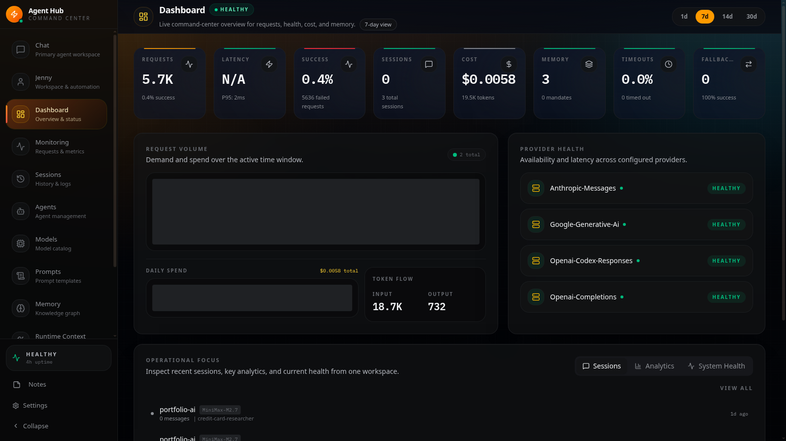
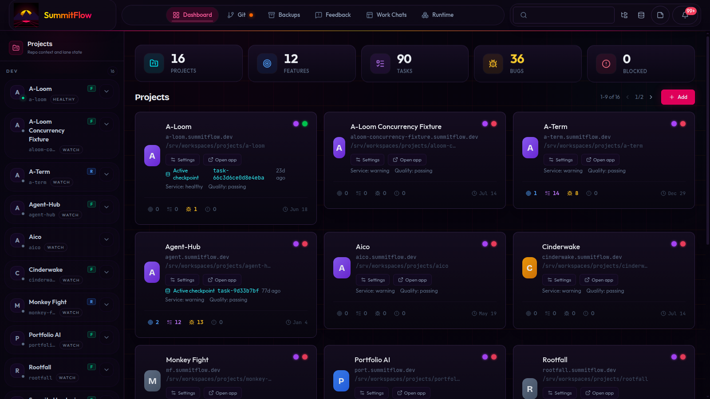

# Elias Leslie — AI, Security Automation, and Infrastructure Tooling

I build practical automation systems at the intersection of **AI automation, security automation, cyber security, agentic developer tooling, and full-stack infrastructure**. My work emphasizes local-first control planes, secure defaults, reproducible release paths, and operator-focused interfaces that turn complex workflows into auditable tools.

I use agentic AI heavily, but I keep the engineering bar concrete: documented setup, real tests, runtime smoke checks, secret hygiene, clean install verification, and honest limitations.

## Background

25+ years in IT and security, spanning hands-on engineering and executive leadership. I grew from Director of IT to Chief Information Security Officer at a managed services provider serving 200+ client environments, building the security program and automation framework that became a primary strategic asset in the company's 2024 acquisition by Integris — then spent the following year as Security Services Architect refactoring that tooling into platform-agnostic frameworks and mentoring engineers on AI-augmented development.

Alongside that, I served as incident commander on ransomware and breach engagements referred through Lloyd's of London cyber insurance underwriters — seven-figure-ransom recoveries across 26 states and multiple countries, directing client engineering organizations, outsourced IT providers, and third-party vendors. OSCP certified.

The projects below are what that experience looks like when I build in the open.

## Projects

Six public platforms released under Apache-2.0, each a standalone repository with documented setup, real checks, CI, a security policy, and honest limitations.

### Agent Hub — self-hosted control plane for multi-provider AI agents

[Repository](https://github.com/elias-leslie/agent-hub) · [Security policy](https://github.com/elias-leslie/agent-hub/blob/main/SECURITY.md)

- **Problem:** Most agent demos stop at chat. Running agents as real infrastructure needs provider routing, persistent memory, sessions, access control, and cost/latency visibility in one governed place.
- **Solution:** A self-hosted control plane that adds the operational layer: unified completions and SSE streaming across many providers, multi-agent orchestration and server-side tool execution, a pgvector memory-first store with tiered context injection, named agents/personas, session history, request/cost telemetry, access control, and operator dashboards.
- **Stack:** FastAPI, Python 3.13, Next.js 16, React, TypeScript, PostgreSQL with pgvector, Redis, Hatchet, pnpm, uv, plus a sync + async Python SDK.
- **What was built:** Provider routing across 12 providers — Gemini, OpenAI, OpenRouter, DeepSeek, Kimi/Moonshot, MiniMax, xAI, Zhipu (GLM), NVIDIA, Cloudflare Workers AI, OpenAI Codex, and any local OpenAI-compatible endpoint — with catalog-driven model resolution, per-agent routing with fallbacks, a provider circuit breaker, and runtime health probing; image generation across four vendor adapters; multi-agent orchestration (committee, maker-checker, chain, parallel) and an agentic server-side tool loop; keyless boot; encrypted credential isolation with OAuth, access control, budgets/quotas, and per-tenant cost attribution; a sync + async Python SDK; ~39 API routers across 191 endpoints and 15 Hatchet workflows.
- **Notable engineering decision:** The memory layer originally ran on a Neo4j/Graphiti knowledge graph. I migrated it to a unified pgvector store — semantic search, episodes, learning extraction, tiering/promotion/retirement, and citation-tracked context injection — collapsing an entire second datastore out of the deployment while keeping the retrieval semantics.
- **Skills demonstrated:** Multi-provider routing, credential boundaries, memory/session infrastructure, schema migration under live semantics, SDK design, operability and observability.
- **Security relevance:** Isolates provider credentials behind access-control surfaces, boots without provider keys (dashboards, health, and sessions stay available), and fails clearly when optional integrations are unconfigured.
- **Status:** Public Apache-2.0 release. Works standalone and as SummitFlow's routed-agent backend. Expose beyond loopback only behind a reverse proxy with strong client/internal secrets.

### Security Hardening Automation (SHA) — bounded control plane for endpoint hardening

[Repository](https://github.com/elias-leslie/sha) · [Security policy](https://github.com/elias-leslie/sha/blob/main/SECURITY.md)

- **Problem:** Endpoint hardening often becomes a brittle mix of one-off scripts, undocumented baseline assumptions, risky remote access, and unclear rollback paths.
- **Solution:** SHA models hardening as a *bounded* control plane: enroll endpoints, collect posture, browse curated controls, generate installer profiles, and route every disruptive action through a typed human approval gate.
- **Stack:** FastAPI, Python 3.13, SQLAlchemy, Pydantic, a cross-compiled Go endpoint agent, Next.js 16, React 19, TypeScript, Vitest, pnpm, uv.
- **What was built:** A control-plane API (15 routers, 49 endpoints) and operator dashboard covering a unified client/site hierarchy, endpoint inventory with device classification, a network discovery scan, controls, installers, and approvals; deterministic Windows/Linux/macOS posture reporters running real read-only checks (host firewall, SSH configuration, root access lock, automatic updates, Microsoft Defender, BitLocker, Secure Boot, FileVault, Gatekeeper) through a full enroll → heartbeat → posture → action-claim → lease-bound-result cycle; 4 curated control packs (17 controls) built by a deterministic, provenance-pinned catalog builder from public NIST SP 800-53 Rev. 5, DISA Windows Server 2022 STIG, and CISA/NSA guidance, every control carrying NIST CSF / SP 800-53 / STIG / CISA mappings; a typed human-in-the-loop approval workflow with bounded grant TTLs (15–240 minutes), manual emergency grants, and append-only tamper-evident audit events; lease-bound action delivery with principal-separated access (operator / read-only / agent) behind fail-closed OIDC with CSRF and origin enforcement; and reversible typed hardening actions with rollback artifacts, weighted per-endpoint posture scores, and a control drift matrix.
- **Demonstrable without a fleet:** The console ships a self-contained demo mode that answers every read from an invented tenant set and refuses every mutation, so it can be screen-shared or published without exposing a real deployment — the screenshot above is that mode.
- **Design stance:** No shell or arbitrary-command endpoint exists anywhere in the API. SHA sits deliberately between pure auditors (Lynis, OpenSCAP) and unbounded appliers (ansible-lockdown, Wazuh active response) — every disruptive action is a typed capability behind a mandatory approval gate.
- **Skills demonstrated:** Security automation design, public-source provenance discipline, approval-boundary modeling, cross-platform agent development, full-stack testing, and clean install verification.
- **Status:** Early-stage working control-plane slice, not a production-ready endpoint-management product. Public Apache-2.0 release.

### SummitFlow — task orchestration and evidence capture for AI-assisted development

[Repository](https://github.com/elias-leslie/summitflow) · [Security policy](https://github.com/elias-leslie/summitflow/blob/main/SECURITY.md)

- **Problem:** AI-assisted development scatters task state, quality gates, and verification evidence across one-off scripts and chat logs, so it is hard to see what was actually built, checked, and proven across projects.
- **Solution:** A local-first control plane that tracks tasks, subtasks, steps, and dependencies; runs quality gates and code-health scans; drives autonomous execution hooks and browser checks; and keeps operator-visible verification evidence. Built for developers running their own agent tooling, not as a hosted SaaS.
- **Stack:** FastAPI, Python 3.13, SQLAlchemy, Alembic, Next.js 16, React, TypeScript, PostgreSQL, Redis, Hatchet, pnpm, uv.
- **What was built:** A FastAPI backend (~30 routers across ~297 routes) and a Next.js operator UI; the `st` CLI — 75 top-level commands and ~262 subcommands spanning tasks, quality gates (ruff/types/pytest/biome/tsc/vitest/sqlfluff/squawk/CodeQL), version control (jj-first), services, databases, browser/UI automation, agents, and backups; ~33 Hatchet workflows including an autonomous ideation → execution → review pipeline with self-healing error recovery; proof-it-ran evidence capture (headless UI screenshots, route/health telemetry, console-error counts); an isolated cleanroom run and an LLM auto-fix agent with pattern memory; Btrfs snapshots and SMB/Veeam-targeted backups; and `summitflow-host-guardian` independent host monitoring.
- **Skills demonstrated:** Full-stack system design, workflow orchestration, CLI and developer-tooling design, runtime smoke verification, and public release discipline (secret/history scanning, dependency remediation, clean install verification).
- **Security relevance:** Keeps agent work local-first and auditable, and degrades clearly when optional integrations (Agent Hub, Hatchet, browser runtime, web push, SMB backups) are absent instead of exposing credentials or crashing unrelated pages.
- **Status:** Public Apache-2.0 release. Pairs with Agent Hub for routed AI completions and shared memory, but runs standalone.

### Portfolio AI — investment intelligence workspace

[Repository](https://github.com/elias-leslie/portfolio-ai) · [Security policy](https://github.com/elias-leslie/portfolio-ai/blob/main/SECURITY.md)

- **Problem:** Financial research workflows need repeatable ingestion, analysis, and reporting without exposing private holdings.
- **Solution:** A self-hosted, full-stack investment intelligence workspace that tracks portfolios and tax lots, scores a watchlist from market data, news, technicals, and fundamentals, computes a macro deployment gate, and optionally routes AI analysis through an Agent Hub companion — all on data you host.
- **Stack:** FastAPI, Python 3.13, SQLAlchemy, Next.js 16, React 19, PostgreSQL, Redis, Hatchet, pandas, scikit-learn, pandas-ta; yfinance, CBOE, FRED, and SEC EDGAR data plus optional paid market-data APIs.
- **What was built:** Portfolio/account/position/tax-lot/transaction tracking with lot-level cost basis and P&L, tax-loss harvesting with wash-sale checks, and IPS target/drift/rebalance planning; a multi-pillar watchlist scorer (price, technical, fundamental, catalyst, options) producing per-symbol composites with plain-language narratives over an S&P 500 research universe; a macro deployment gate (FULL_DEPLOY / REDUCED / DEFENSIVE) computed from VIX term structure, credit spreads, put/call, breadth, and factor crowding, with walk-forward and Monte Carlo backtests; a scikit-learn article-quality classifier and TF-IDF news clustering; household money, document-intake, budgeting, and retirement (Monte Carlo) surfaces with encrypted Plaid/SnapTrade linking; ~63 cron-scheduled Hatchet workflows; and a read-only MCP server.
- **Skills demonstrated:** Multi-source data pipelines, quantitative/technical analysis, lightweight ML, workflow orchestration at scale, full-stack reporting UI, and privacy-aware public documentation.
- **Security relevance:** Boots without optional keys (degrading rather than failing), encrypts source and broker credentials at rest, keeps all LLM access behind Agent Hub with no hardcoded model IDs, and publishes only synthetic claims — no real balances, holdings, transactions, account IDs, or live portfolio values.
- **Status:** Public Apache-2.0 release; users configure their own data sources and secrets.

### A-Term — browser workspace for AI coding agents

[Repository](https://github.com/elias-leslie/a-term) · [Security policy](https://github.com/elias-leslie/a-term/blob/main/SECURITY.md)

- **Problem:** Agentic coding needs shells, files, prompts, and notes in one browser-accessible environment, and naive web terminals lose their session the moment the tab closes.
- **Solution:** A self-hosted browser workspace that runs multiple persistent, tmux-backed terminal sessions (Claude Code, Codex, Gemini CLI, Hermes, OpenCode, Pi, and shells) side by side in a resizable pane grid, with a file browser, a notes/prompt library, voice input, and full mobile support.
- **Stack:** FastAPI, Python 3.13, SQLAlchemy, Alembic, PostgreSQL, Next.js 16, React 19, TypeScript, xterm.js (WebGL), tmux, Tailwind CSS 4, pnpm, uv.
- **What was built:** WebSocket PTY terminals over tmux for crash-proof sessions; up to six resizable panes with detach-to-window; per-pane dual shell/agent mode with built-in tool presets and custom tools; a sandboxed file browser with validated uploads; a notes/prompt library with version history and Agent-Hub-backed prompt cleaning; browser-native voice input; an on-screen keyboard and PWA install for mobile; and three auth modes (loopback/password/proxy) with security headers, CSP, and rate limiting.
- **Skills demonstrated:** Real-time WebSocket/PTY streaming with backpressure, terminal/session orchestration, full-stack developer-experience tooling, mobile/PWA support, and secure-by-default remote access.
- **Security relevance:** Ships loopback-only by default, isolates the file browser against path traversal, and centralizes agent working context locally instead of in a hosted service.
- **Status:** Public Apache-2.0 release. Runs standalone, or pairs with SummitFlow and Agent Hub for shared projects, prompt cleaning, and a model catalog.

### Aico — desktop companion for terminal AI agents

[Repository](https://github.com/elias-leslie/aico) · [Security policy](https://github.com/elias-leslie/aico/blob/main/SECURITY.md)

- **Problem:** Terminal AI agents are useful but fragmented across shells, browser context, desktop selection, and project state.
- **Solution:** A Linux desktop companion that wraps seven terminal AI CLIs (Claude Code, Codex, opencode, Gemini CLI, Pi, Hermes, shells) in persistent tmux-backed "lantern" widgets, with a command palette, per-agent context-mandate verification, a loopback FastAPI sidecar, click-to-context capture, and optional browser/voice integrations.
- **Stack:** Electron, TypeScript, Vite, xterm.js, node-pty, FastAPI, Python 3.13, tmux, uv, Node.js, MV3 browser extension APIs.
- **What was built:** Frameless terminal widgets backed by persistent per-widget tmux sessions; a searchable command palette and pinned controls; per-agent context-mandate verification (✓/⚠ badges); a loopback FastAPI sidecar and MV3 browser extension for click-to-context capture; optional desktop window/region/OCR grab and voice dictation; and an AppImage build with a bundled PyInstaller sidecar, CI, and release hardening (SHA256SUMS + build provenance).
- **Skills demonstrated:** Desktop/Electron integration, local sidecar API design, tmux/session orchestration, browser-context capture, and release hardening.
- **Security relevance:** Keeps sensitive workflow state local by default, uses loopback APIs, and degrades when optional integrations are absent.
- **Status:** Public Apache-2.0 release for single-user Linux desktops; Wayland/global shortcut support varies by desktop environment.

## Private work

**BlackBox — zero-knowledge encrypted media archive.** A private, self-hosted archive spanning a Kotlin/Jetpack Compose Android client and a Go vault service, built around nine documented security invariants that a change may not weaken without a recorded decision. Media is sealed with AES-256-GCM under Android Keystore (StrongBox where available) *before* it is written to disk, so plaintext never reaches storage; there is no write path to `MediaStore` or any shared collection, no exported provider or `FileProvider`, `allowBackup=false`, and `FLAG_SECURE` on every window. The vault server never holds a media decryption key.

Every device generates a P-256 key at first run and its identity *is* the SHA-256 of that public key, so listeners present a self-signed certificate whose key is the identity key and pinning an invitation fingerprint authenticates the specific device rather than a name a CA could reissue. Recovery runs through a five-word EFF-long-list passphrase (64.6 bits) stretched with Argon2id (64 MiB, t=3), with the archive publishing only salt, cost parameters, and a public key. Storage is content-addressed and immutable with additive mirroring, copy-census-gated eviction, and tombstoned deletes that still reach an archive drive that was offline at the time.

Source is private, but I am happy to walk through the architecture and threat model on request.

## Capability areas

- **Security leadership:** security program design, fractional CISO governance, board and underwriter communication, incident command, third-party risk, CMMC/DFARS/HIPAA/PCI/CJIS compliance.
- **Security automation:** endpoint hardening, control-catalog provenance, approval boundaries, incident containment, detection workflows, evidence exports, rollout/rollback discipline.
- **AI automation and agentic tooling:** multi-provider control planes, local-first agent workflows, prompt/session/memory infrastructure, terminal and browser context capture, supervised automation boundaries.
- **Cyber security engineering:** secure defaults, applied cryptography and key management, secret scanning, local API boundaries, install-time dependency verification, public release hygiene.
- **Full-stack infrastructure:** FastAPI, Next.js/Electron, PostgreSQL/pgvector/Redis, workflow orchestration, operator dashboards, Linux service and runtime integration.

## Contact

- LinkedIn: <https://linkedin.com/in/elias-leslie>
- GitHub: <https://github.com/elias-leslie>

_Last updated: 2026-08-23_
